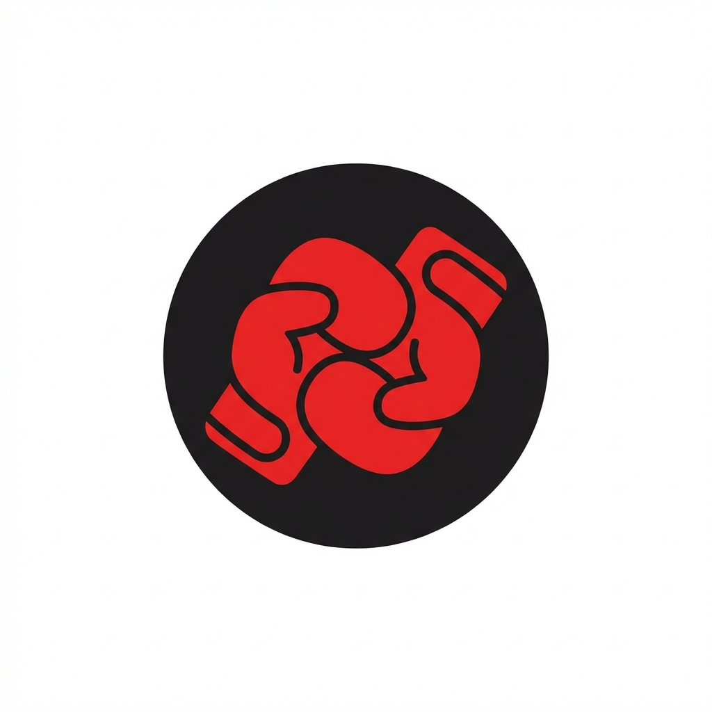
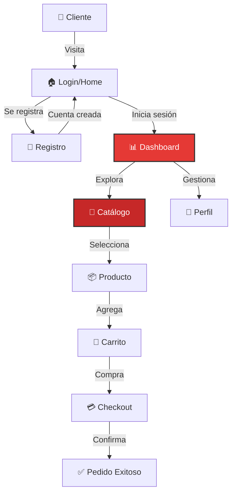

<table>
  <tr>
    <td width="150">
      
    </td>
    <td>
      <h1>Boxing Store</h1>
      <em>"Tu tienda de artículos de boxeo"</em>
    </td>
  </tr>
</table>


## 💡 Sobre Boxing Store

**Boxing Store** es una tienda en línea especializada en artículos de boxeo. Desde guantes hasta equipamiento completo, todo lo que necesitas para entrenar como un campeón.

### ✨ Características Principales

* **Catálogo de Productos** - Guantes, sacos, protecciones
* **Sistema de Compras** - Carrito y checkout
* **Autenticación** - Login y registro seguros
* **Dashboard** - Panel de usuario personalizado

### 🔄 Flujo de Usuario



---

## ✨ Características Destacadas

| ⚡ Funcionalidad | 📌 Detalle |
|-----------------|-----------|
| **Autenticación Segura** | Contraseñas hasheadas |
| **Catálogo Completo** | Equipamiento de boxeo |
| **Carrito de Compras** | Sistema funcional |
| **Perfil de Usuario** | Gestión de datos |
| **Diseño Responsive** | Adaptable a cualquier dispositivo |

---

## 🎨 Badges & Estado


---

## ⚙️ Instalación y Configuración

### 1️⃣ Clonar el Repositorio

```bash
git clone https://github.com/JoseEduardoGR/Boxing-Store.git
cd Boxing-Store
```

### 2️⃣ Configurar Base de Datos

```sql
CREATE DATABASE boxing_store;
USE boxing_store;
SOURCE sql/database.sql;
```

### 3️⃣ Configurar Conexión

Edita `config/database.php`:

```php
private $host = "localhost";
private $db_name = "boxing_store";
private $username = "tu_usuario";
private $password = "tu_password";
```

### 4️⃣ Iniciar Servidor

```bash
php -S localhost:8000
```

Abre `http://localhost:8000` en tu navegador.

---

## 📂 Estructura del Proyecto

```
BOXING-STORE/
├── config/
│   └── database.php         # Conexión a BD
├── css/
│   └── styles.css           # Estilos
├── js/
│   └── validation.js        # Validaciones
├── sql/
│   └── database.sql         # Esquema BD
├── dashboard.php            # Panel de usuario
├── index.php                # Login
├── register.php             # Registro
├── logout.php               # Cerrar sesión
├── products.php             # Catálogo
├── profile.php              # Perfil
├── LICENSE                  # Licencia MIT
└── README.md                # Este archivo
```

---

## 🥊 Categorías de Productos

| Categoría | Descripción |
|-----------|-------------|
| **Guantes** | Entrenamiento y competencia |
| **Protecciones** | Careta, bucal, vendas |
| **Sacos** | Diferentes tamaños |
| **Ropa** | Shorts, playeras |
| **Accesorios** | Cuerdas, bolsas |

---

## 🛠️ Tecnologías Utilizadas

| Tecnología | Uso |
|------------|-----|
| **PHP 8+** | Backend |
| **MySQL** | Base de datos |
| **PDO** | Conexión segura |
| **CSS3** | Diseño |
| **JavaScript** | Validación |

---

## 🏆 Créditos

**JoseEduardoGR** – Desarrollo y diseño.

💻 Proyecto educativo de preparatoria.

---

## 📄 Licencia

Este proyecto está bajo la **Licencia MIT** - ver el archivo [LICENSE](LICENSE) para más detalles.

---

<div align="center">
  <p>🥊 Hecho con ❤️ por <a href="https://github.com/JoseEduardoGR">JoseEduardoGR</a></p>
  <p>Entrena como un campeón</p>
</div>
